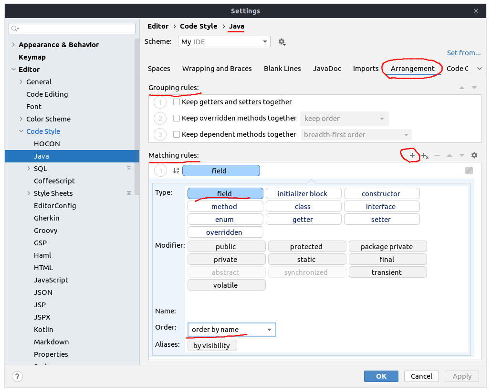

## Common Rule 4: Порядок полей класса

### Поля в классе располагать в алфавитном порядке.

IDEA поддерживает автоматическую сортировку полей классов. Настройка для Java:

1. Перейти в настройки `File | Settings | Editor | Code Style | Java | Arrangement`
2. Убрать все галочки из `Grouping rules`
3. Удалить все правила из `Matching rules`
4. Добавить правило (зачок **+** или Alt+Insert), выбрать `Type: field`, выбрать `Order: order by name`, другие свойства не менять.
5. Задать стандартные пустные строки после заголовка класса и вокруг полей: перейти в раздел `Blank lines` и в полях `After class header` и `Around field` вписать **1**.
6. Теперь, когда вам нужна пересортировка полей в классе, вы можете кликнуть `Code | Rearrange Code` и поля в текущем открытом файле будут отсортированы в соответствии с заданными правилами.





### При перечислении полей в классе, их порядок должен сохраняться и в конструкторе.

В случае наследования в перечислении в конструкторе первыми идут поля, которые объявлены в базовом/-ых классах.

IDEA поддерживает автоматическое добавление полей в конструктор для Java. После того, как добавили поле класса, нажмите Alt + Enter на нём, и IDEA предложит добавить это поле как входной параметр конструктора. И если сделать эту операцию, то IDEA добавит параметр в конструктор согласно порядку полей при объявлении. 

Java:

```
@Singleton
public class SomeService {
    //region Fields

    private final DateParser dateParser;

    private final SomeExtractor someExtractor;
    
    //endregion
    //region Ctor

    @Inject
    public SomeService(DateParser dateParser, SomeExtractor someExtractor) {
    
        this.dateParser = dateParser;
        this.someExtractor = someExtractor;
    }
    
    //endregion
}
```

Typescript:

```
@Injectable({
    providedIn: "root"
})
public class SomeService {
    //region Fields

    private readonly DateParser _dateParser;

    private readonly SomeExtractor _someExtractor;
    
    //endregion
    //region Ctor
    
    constructor(DateParser dateParser, SomeExtractor someExtractor) {
    
        this._dateParser = dateParser;
        this._someExtractor = someExtractor;
    }
    
    //endregion
}
```
