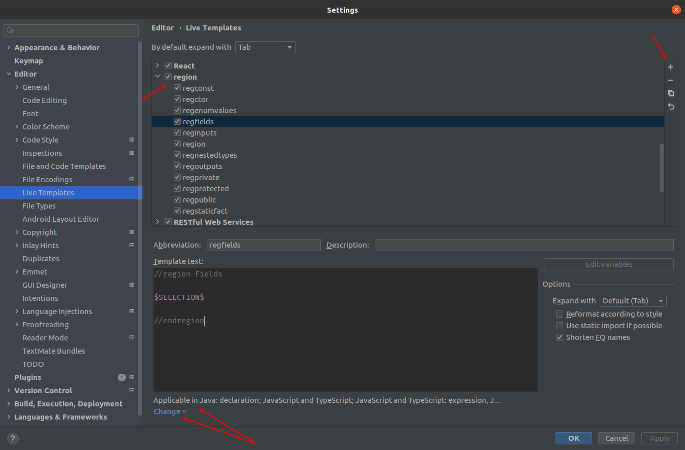

## Common Rule: Оформление регионов

1. Всегда использовать регионы для разграничения логики в классе.
2. Состав и порядок основных регионов определён ниже.
3. Между основными регионами пустой строки нет.
4. Для legacy-кода внутри основных регионов могут встречаться вложенные регионы. Так, например, регион `Migrations` вложен в регион `Public` в примере ниже.
5. Вложенные регионы обособляются пустой строкой от внешнего сверху и/или снизу. Между идущими подряд вложенными регионами пустой строки нет.
6. Вложенные регионы допустимы только для legacy-кода. В новом коде вложенные регионы не должны встречаться.

Состав и порядок основных регионов для Java:

- `Constants` - Константы класса. При большом количестве констант регион можно разбить на `Public constants`, `Protected constants` и `Private constants`.
- `Fields` - Поля класса. При большом количестве полей регион можно разбить на `Public fields`, `Protected field` и `Private fields`.
- `Ctor` - Конструкторы класса.
- `Static factories` - Статические фабричные методы.
- `Public static` - Публичные статические методы класса.
- `Public` - Публичные методы экземпляра класса.
- `Protected static` - Защищённые статические методы класса.
- `Protected` - Защищённые методы экземпляра класса.
- `Private static` - Приватные статические методы класса.
- `Private` - Приватные методы экземпляра класса.

Состав и порядок основных регионов для TypeScript:

- `Constants` - Константы класса. При большом количестве констант регион можно разбить на `Public constants`, `Protected constants` и `Private constants`.
- `Inputs` - Входящие данные "тупого" Angular компонента.
- `Outputs` - Исходящие события "тупого" Angular компонента.
- `Fields` - Поля класса. При большом количестве полей регион можно разбить на `Public fields`, `Protected field` и `Private fields`.
- `Ctor` - Конструкторы класса.
- `Hooks` - Методы Angular-компонента, представляющие его этапы жизненного цикла.
- `Getters and Setters` - `get` и `set` методы TypeScript'а.
- `Public static` - Публичные статические методы класса.
- `Public` - Публичные методы экземпляра класса.
- `Events` - Обработчики событий.
- `Protected static` - Защищённые статические методы класса.
- `Protected` - Защищённые методы экземпляра класса.
- `Private static` - Приватные статические методы класса.
- `Private` - Приватные методы экземпляра класса.

Пример для Java:

```
/**
 * <p>...</p>
 */
public final class ClassName {
    //region Constants

    /**
     * <p>...</p>
     */
    private static final String STRING_CONSTANT = "string constant value";

    //endregion
    //region Fields
    
    /**
     * <p>...</p>
     */
    private final SomeService someService;
    
    /**
     * <p>...</p>
     */
    private final HttpClient httpClient;
    
    //endregion
    //region Ctor

    /**
     * <p>Конструктор класса ...</p>
     *
     * @param someService ...
     */
    @Inject
    public ClassName(SomeService someService) {

        this.someService = someService;
        this.httpClient = HttpClient.newBuilder()
            .version(HttpClient.Version.HTTP_1_1)
            .build();
    }

    //endregion
    //region Public

    //region Migrations

    /**
     * <p>Возвращает ...</p>
     *
     * @return ...
     */ 
    public List<String> getMigrationLocations() {

        return ...;
    }

    //endregion

    //endregion
}
```

Для Typescript аналогично.


---


Регионы приходится оформлять довольно часто и много. Легко допустить ошибку. Печатать и проверять их постоянно может надоесть. Чтобы это автоматизировать, можно воспользоваться Live Template'ами Idea. Они позволяют настроить фразу, напечатав которую можно развернуть нужный шаблон. (Стандартные известные многим Live Template'ы, например - `sout` для `System.out.println();` или `psvm`).

На скриншоте ниже видно, каким образом можно их задать.



- В `Applicable in` для Java - `Declaration`, для js и ts - все пункты.
- `$SELECTION$` - это то место, куда переместится курсор после разворачивания шаблона.
- Фразы для автоподстановки, конечно, можно придумать свои.
- Ожидаемый результат после настройки, например, для `Fields`: вместо того, чтобы печатать `//region Fields` можно напечатать `regfields` + Tab, после чего развернётся шаблон и курсор окажется между `//region Fields` и `//endregion`.
- Так как Idea подсказывает такие шаблонный фразы, то не обязательно всегда полностью печатать фразу, достаточно выбрать из предложенных после ввода начала фразы.