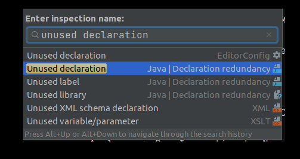
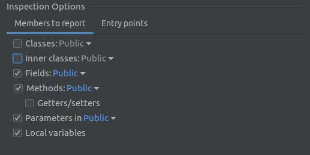

## Code style tools 1: Inspect code

Inspect code это инструмент Idea с большим количеством настроек для поиска проблемных участков кода.
Хоть инструмент и можно адаптировать под различные требования проекта, но у него есть недостаток в формировании
найденных проблем - текущих видов компоновки и фильтров недостаточно для быстрого решения точечных проблем.

Настройка производится в File -> Settings... -> Editor -> Inspections.
Можно сделать несколько профилей с разными настройками. Помимо включения и отключения настроек, им можно задать
уровень важности, по которым их можно будет группировать во время просмотра результатов.

Областью проверки может быть класс, модуль, весь проект и т.д. Для возможности выбрать конкретный класс - его нужно предварительно открыть. Для выбора модуля - открыть любой класс нужного модуля.

Есть несколько способов запуска:

- Полная проверка правил профиля Analyze -> Inspect Code...

- Отдельное правило Analyze -> Run Inspection by Name... -> Ввод названия правила, которое можно подсмотреть
в настройках инспекции (например, Unused declaration).
В таком способе можно задать временную настройку выбранного правила, не меняя выставленные настройки в профиле.

#### 1. Поиск неиспользуемых полей, параметров и методов в Java файлах

В Run Inspection by Name... вводим unused declaration и выбираем тот, что из категории Declaration redundancy

Отображается окно с выбором scope поиска и настройками правил.
В опциях уровень инкапсуляции работает по принципу: поиск по выбранному уровню и уровням, вложенным в него.
Например, private содержит только private, а public содержит все уровни в себе.

После запуска результат отображается во вкладке Inspection Results, но просмотр через эту вкладку неудобный,
приходится руками перебирать много лишнего.
Поиск проблем выдаёт не только неиспользуемые методы, но и методы классов без инстантов
(он не понимает, что они инжектированы с помощью DI).
По описанию "найденной проблемы" они будут отличаться, но сгруппировать их отдельно друг от друга нельзя.
Можно облегчить поиск, выгрузив результат в XML, и искать по тегу description.
Для неиспользуемых методов это `Method is never used`.